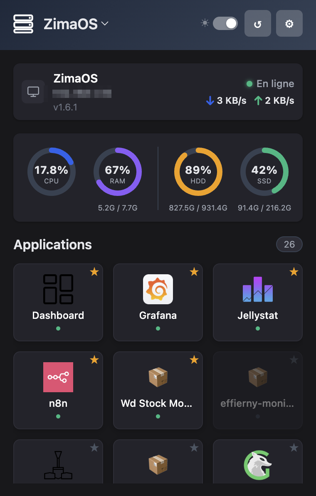
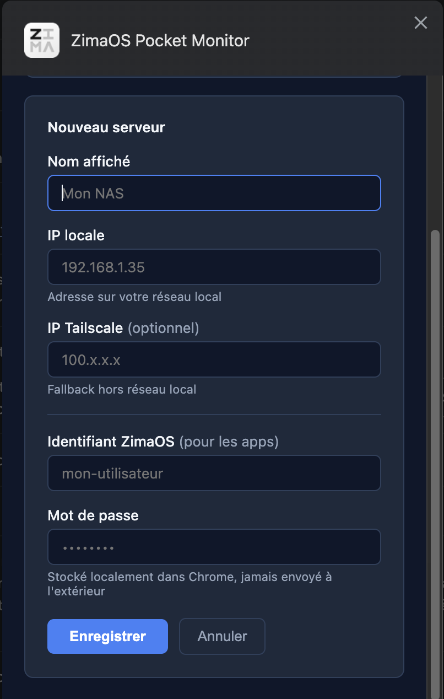

# ZimaOS Pocket Monitor

Extension Chrome pour surveiller ton serveur ZimaOS depuis la barre de navigation : stats système en temps réel, liste des applications, réseau et stockage.

 

 

---

## Fonctionnalités

- **Monitoring temps réel** — CPU, RAM, disques (mise à jour toutes les 5s)
- **Réseau** — débit download / upload en direct
- **Applications** — liste de tous tes containers avec leur statut (running / stopped)
- **Favoris** — épingle tes apps favorites en haut de la liste (★)
- **Tooltips** — survole CPU, RAM, ↓ ou ↑ pour voir la consommation par container
- **Multi-serveur** — gère plusieurs NAS, bascule en un clic
- **Thème clair / sombre** — toggle dans le header

---

## Prérequis sur le NAS

L'extension communique directement avec les services suivants. Ils doivent être accessibles depuis ton réseau (local ou Tailscale) :

| Service | Port | Rôle |
|---------|------|------|
| ZimaOS API | `80` / `9527` | Liste des applications |
| Glances | `61208` | CPU, RAM, réseau, disques, containers |
| node-exporter | `9100` | Stockage précis (optionnel) |

> **Glances** est l'élément le plus important. Sans lui, les stats et tooltips ne fonctionneront pas.

---

## Installation

### 1. Télécharger l'extension

Télécharge et décompresse le fichier `.zip` dans un dossier sur ton ordinateur. Retiens bien l'emplacement.

### 2. Activer le mode développeur dans Chrome

1. Ouvre Chrome et va à l'adresse : `chrome://extensions`
2. En haut à droite, active le toggle **"Mode développeur"**

### 3. Charger l'extension

1. Clique sur **"Charger l'extension non empaquetée"**
2. Sélectionne le dossier que tu as décompressé à l'étape 1
3. L'extension apparaît dans la liste — c'est bon !

### 4. Épingler l'extension (recommandé)

1. Clique sur l'icône puzzle 🧩 à droite de la barre d'adresse
2. Clique sur l'épingle à côté de **ZimaOS Pocket Monitor**

---

## Configuration

Au premier lancement, clique sur l'icône de l'extension puis sur **⚙** pour ouvrir les paramètres.

| Champ | Description                                            |
|-------|--------------------------------------------------------|
| Nom | Nom affiché dans le header (ex: "Mon NAS")             |
| IP locale | IP de ton NAS sur le réseau local (ex: `192.168.x.xx`) |
| IP Tailscale | IP Tailscale pour l'accès à distance (ex: `100.x.x.x`) |
| Utilisateur | Identifiant ZimaOS                                     |
| Mot de passe | Mot de passe ZimaOS                                    |

L'extension essaie d'abord l'IP locale, puis Tailscale en fallback si elle est injoignable.

---

## Mise à jour

L'extension ne se met pas à jour automatiquement en mode développeur. Pour mettre à jour :

1. Remplace les fichiers du dossier par la nouvelle version
2. Va sur `chrome://extensions`
3. Clique sur l'icône **↺** de l'extension pour recharger

---

## Dépannage

**Les stats ne s'affichent pas**
→ Vérifie que Glances tourne sur ton NAS et est accessible sur le port `61208`

**Aucune application n'apparaît**
→ Vérifie l'IP et les identifiants dans les paramètres (⚙)

**L'extension disparaît après redémarrage de Chrome**
→ Normal en mode développeur si Chrome est en mode invité. Utilise un profil Chrome permanent.

**Le stockage HDD/SSD ne s'affiche pas**
→ node-exporter n'est pas installé ou accessible. Les disques seront lus via Glances en fallback (moins précis).
